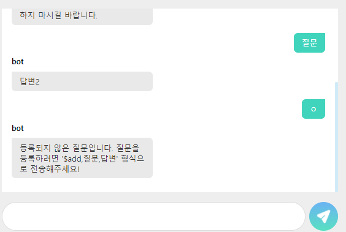

# SimpleChatbot(With Javascript)


## how  to Run?

```bash
#server start:
cd SimpleChatbot
npm start
```


---

## Skills

FE: , 

BE: 


---

## Collaborator

design: [최송은](https://github.com/ostrichtofu)

programming: [김기현](https://github.com/kiheyunkim)


------

## feature

> 1. $add,{질문내용},{대답내용}을 통해 등록 - Upsert를 통해서 중복 등록이 되지 않도록 함.

> 2. 질문내용을 치면 해당 내용에 대한 저장된 답변을 돌려줌.

---

## ScreenShot



---

## DB Scheme

```mysql
CREATE DATABASE IF NOT EXISTS CHATBOT;
USE CHATBOT;

CREATE TABLE IF NOT EXISTS MESSAGE(
    request varchar(50) not null,
    response varchar(50) not null
);

ALTER TABLE MESSAGE ADD UNIQUE (request);
```


---

## known issue

없음

---

## License
